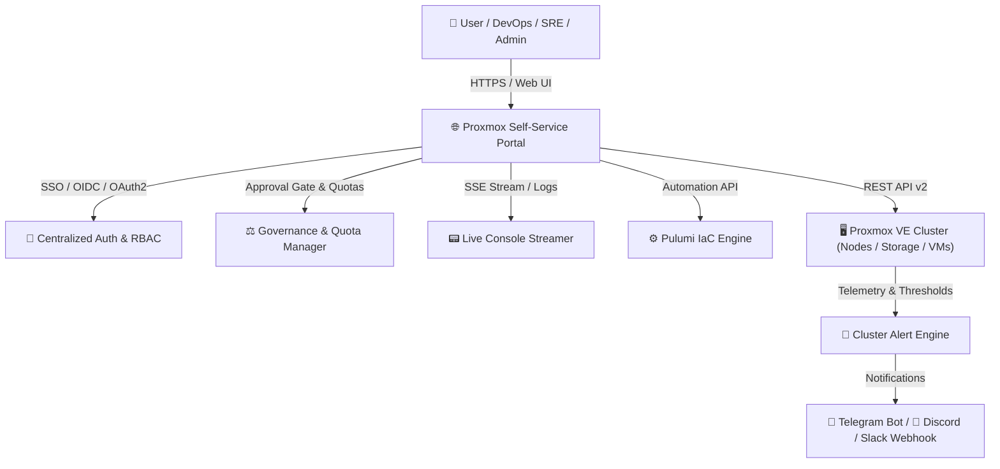

# 🚀 Proxmox VE Self-Service Portal & IaC Automation with Pulumi

Tài liệu tiếng Việt: [README.md](./README.md) | **English**

---

An enterprise-ready, self-service infrastructure portal and automation platform for **Proxmox VE** virtualization clusters (**QEMU VMs** & **LXC Containers**) using **Infrastructure as Code (IaC)**. Built on **Pulumi Automation API**, **Node.js (TypeScript)**, an **Enterprise Dark Glassmorphism** Web Dashboard, and **Full Bilingual Support (English 🇬🇧 & Vietnamese 🇻🇳)**.

---

## 🌟 Key Features



---

### 1. 🌐 Full Bilingual Support (English 🇬🇧 / Vietnamese 🇻🇳)
* **Instant 1-Click Language Switcher**: Toggle smoothly between **`🇬🇧 English`** and **`🇻🇳 Tiếng Việt`** without reloading the page.
* **100% Comprehensive Interface Localization**: Complete translation of the 4-step creation wizard, resource cards, threshold alerts, hardware hotplug modal, firewall manager, and app catalog.
* **Real-time Live Console Translation (`formatConsoleLog`)**: Automatically formats and translates Server-Sent Events (SSE) log streams according to the active language.

---

### 2. 🔑 Centralized Single Sign-On (SSO) & 3-Tier RBAC Governance
* **Multi-Provider Authentication (SSO / OAuth2 / OIDC)**:
  * 🌐 **Google Workspace OAuth2**: Sign in with company Google accounts, domain restriction (`GOOGLE_ALLOWED_DOMAINS`), and email-based admin/developer role mapping.
  * 🐙 **GitHub OAuth / Enterprise**: Sign in with GitHub accounts, automatic organization and team membership validation (`read:org`).
  * 🟣 **Keycloak / Authelia / Okta / Authentik (Generic OIDC)**: Auto-discovery via `/.well-known/openid-configuration`, groups/roles claims parsing to assign portal RBAC roles dynamically.
  * 🛡️ **Local Break-glass Fallback**: Built-in emergency local credentials in `.env` ensuring administrator access even during external IdP outages.
* **3-Tier Role-Based Access Control (RBAC)**:
  * **👑 Administrator (`admin`)**: Full authority; create, reconfigure, control power, snapshot, firewall, and delete VMs across all environments (`DEV`, `STAGING`, `PROD`).
  * **👨‍💻 Developer (`developer`)**: Strictly bound by multi-tenancy policies — **can only deploy, manage power, and take snapshots in the `DEV` environment**; requests for `STAGING`/`PROD` or exceeding quotas are routed to the Approval Queue.
  * **👁️ Viewer (`viewer`)**: **Read-only** mode; view cluster health, VM lists, Live Web Console, and Audit Logs with VM creation, power toggling, snapshot, and deletion controls fully restricted.
* **Audit Logging & Compliance Traceability**:
  * Comprehensive audit trail: **Timestamp**, **Username & Role**, **Action**, **Target VM/Stack**, **Environment**, **Status (SUCCESS / DENIED)**, and **Failure/Denial reasons**.

---

### 3. ⚡ Live Hardware Hotplug & Multi-Disk Attachment
* **Live CPU & RAM Hotplugging**:
  * Adjust vCPU cores and RAM capacity (MB/GB) on running virtual machines on the fly **without downtime, reboot, or destroying the Pulumi stack**.
  * Automatic developer quota validation before hot-applying changes.
* **Online Disk Resize (Expansion)**:
  * Expand virtual disks online (`+10G`, `+50G`...) directly through Proxmox VE QEMU Resize API without interrupting guest operating systems.
* **Multi-Disk Attachment Across Diverse Storage Pools**:
  * **Multi-Disk VM Provisioning**: Host OS on fast NVMe/`local-lvm` and attach secondary data disks on HDD/`zfs-storage`.
  * **Hot-attach Secondary Disks**: Add new virtual disks (`scsi1`, `scsi2`...) to running VMs with 1 click.
  * **Safe Detach**: Safety guards prevent accidental detachment of the primary boot disk (`scsi0`).

---

### 4. 🚨 Cluster Resource Threshold Alerting & Multi-Channel Notifications
* **Background Telemetry Alert Engine**:
  * Continuous automated cluster scanning every 30 seconds.
  * Detects Storage Pool usage exceeding threshold ($\ge 85\%$) and overloaded Node CPU/RAM ($\ge 85\%$).
  * Auto-resolves alerts when utilization normalizes.
* **Instant Multi-Channel Notification Dispatcher**:
  * 📱 **Telegram Bot API**: Sends styled HTML notifications with real-time utilization metrics and quick action links.
  * 🔔 **Webhooks (Discord / Slack / Microsoft Teams / API Gateways)**: Dispatches color-coded embedded cards (Warning / Critical / Resolved).
  * 🔴 **Live In-App Alert Banner & Bell**: Sticky top banner and pulsating red bell indicator in the header.
  * 🛑 **Visual Highlighting**: Danger-red progress bars and overloaded badges on affected nodes and storage pools.

---

### 5. 🛡️ Proxmox VE Firewall & Security Rules Management
* **Direct Port & Security Rule Management**:
  * Add, edit, toggle, and delete firewall rules per VM (TCP/UDP/ICMP, Inbound/Outbound ports, Source/Dest IP whitelisting).
  * Global VM firewall options management (Policy `DROP` / `ACCEPT`, Enable/Disable firewall).
* **1-Click Security Rule Presets**:
  * 🌐 **Web Server**: Quick open Port 80 (HTTP) & 443 (HTTPS).
  * 🔑 **SSH Remote**: Secure Port 22 (SSH) open to specific IP ranges or public.
  * 🐘 **Database**: Open Port 5432 (PostgreSQL), 3306 (MySQL), 6379 (Redis).
  * ⛵ **Kubernetes**: Open Port 6443 (K8s API Server).

---

### 6. ⚖️ Resource Quotas & Approval Gateway Workflow
* **Role-Based Resource Quotas (Developer Quotas)**:
  * Strict resource ceilings for Developer accounts: **Max 2 active VMs**, **Max 4 vCPUs**, **Max 8GB RAM (8192 MB)**.
  * Dedicated **Phê Duyệt & Quota** tab with live telemetry progress bars (% RAM, % vCPU, % VMs).
* **Approval Gateway Automation**:
  * If a Developer requests VM creation on **`STAGING` / `PROD`** or requests specs **exceeding their quota**, the request is automatically routed into the Approval Queue.
  * **Admin 1-Click Governance**: Administrators can review, **Approve**, or **Reject with reasons** directly from the UI. Pulumi engine triggers automatically upon approval.

---

### 7. 📦 Dual Workload (QEMU VMs & LXC Containers) & App Catalog
* **QEMU Virtual Machines & LXC Containers**:
  * Choose between full OS isolation (QEMU) and ultra-lightweight containers (LXC with 1-second instant boot).
* **1-Click Enterprise App Catalog Stacks**:
  * 🐘 **PostgreSQL 16 Enterprise**: Automated PostgreSQL 16 installation, database `appdb`, user `appuser`, and remote listening.
  * ⚡ **Redis 7 In-Memory**: Installs Redis Server, password protection, Maxmemory LRU policy, and port 6379.
  * 🪣 **MinIO Enterprise S3 Storage**: Downloads MinIO binary, provisions systemd service, Web Console (port 9001) / S3 API (port 9000).
  * ⛵ **Kubernetes (k3s Node)**: Bootstraps a lightweight k3s node with proper kubeconfig permissions.
  * 🐳 **Docker & Docker Compose**: Installs complete containerization environment.
  * 🌐 **NGINX Web Server**: Ready-to-use reverse proxy and static web server setup.

---

### 8. 🧙‍♂️ Multi-Step VM Creation Wizard & Visual OS Selector
* **Visual OS Distro Presets & Quick Selection**:
  * 🐧 **Ubuntu Linux**: Ubuntu Server LTS (24.04 / 22.04 LTS) Cloud-Init / ISO.
  * 🐧 **Debian GNU/Linux**: Debian 12 Bookworm / 11 Bullseye Cloud-Init / Stable.
  * 🐧 **Rocky / Enterprise Linux**: Rocky Linux 9 / AlmaLinux 9 / CentOS RHEL-compatible.
  * 🐧 **Alpine Linux**: Ultra-Lightweight / Micro Cloud-Init.
  * 🪟 **Windows Server / Desktop**: Windows Server 2022 / 2019 / Windows 11 ISO.
  * 📁 **Custom Storage Files**: Direct raw ISO/Img file picker from storage pools with real-time fuzzy search.
* **Smart Storage Image Auto-Detection**:
  * Scans all Proxmox Storage pools on the selected Node for matching files (`ubuntu*`, `debian*`, `rocky*`, `win*`...).
  * Auto-selects the optimal version and displays an in-place version dropdown if multiple images are available (e.g., both 22.04 and 24.04).
* **Standard Image Naming Convention on Proxmox VE (`local:iso/...`)**:
  | Operating System | Recommended Storage File Name | Image Type |
  | :--- | :--- | :--- |
  | **Ubuntu Linux** | `ubuntu-24.04-cloud.img` or `ubuntu-22.04-cloud.img` | Cloud-Init (.img / .qcow2) |
  | **Debian Linux** | `debian-12-cloud.img` or `debian-11-cloud.img` | Cloud-Init (.img / .qcow2) |
  | **Rocky / Alma Linux** | `rocky-9-cloud.img` or `almalinux-9-cloud.img` | Cloud-Init (.img / .qcow2) |
  | **Alpine Linux** | `alpine-3.20-cloud.img` | Cloud-Init (.img / .qcow2) |
  | **Windows Server** | `Windows_Server_2022.iso` | Installer ISO (.iso) |

* **Proxmox VE Tag Sanitizer**: Automatically cleans and enforces valid tag naming rules (`^[a-z0-9_][a-z0-9_\-\.]*$`), preventing HTTP 400 Parameter Verification errors.
* **Guided 4-Step Provisioning Flow**:
  * **Step 1**: VM Name, Environment badge (`DEV`, `STAGING`, `PROD`), Batch Count (1-10 VMs), and Target Node / Round-Robin mode.
  * **Step 2**: Proxmox Node, OS Image/Template, and primary Storage Pool (with real-time Free / Total capacity display).
  * **Step 3**: Hardware Specs (vCPU, RAM, OS Disk), **Secondary Disks** on different storage pools, Network Bridge & VLAN Tag.
  * **Step 4**: Cloud-Init User-Data script, 1-click Presets (Docker, Nginx, Hardening), and SSH Public Key.

---

### 9. 📊 Cluster Telemetry & VM Lifecycle Management
* **Sticky Node Quick Navigation**: Smoothly jump to specific nodes with purple glow highlighting.
* **Instant Fuzzy Search**: Real-time filtering across VM Names, IDs, IPs, Nodes, Environments, and custom Tags.
* **Full Lifecycle Controls**: Start, ACPI Shutdown, Force Stop, Reboot, Force Reset.
* **Embedded Web Console**: Direct noVNC Console modal without logging into Proxmox VE web GUI.
* **Snapshot Manager**: Create snapshots (with RAM state), rollback point-in-time, and delete old snapshots.

---

## 📁 Directory Structure

```text
pulumi-proxmox/
├── public/                       # Web Portal Frontend (Dark Glassmorphic UI)
│   ├── index.html                # HTML layout, modals, wizard, sub-tabs & i18n hooks
│   ├── style.css                 # CSS Design System & Responsive layout
│   ├── i18n.js                   # Bilingual dictionary (vi / en) & Dynamic Localizer
│   └── js/                       # Feature-based Frontend Modules (Modular JavaScript)
│       ├── main.js               # Entry point, tab routing, dark theme & boot initialization
│       ├── auth.js               # User authentication, SSO callback, RBAC, change password
│       ├── wizard.js             # 4-step VM creation form, OS presets, app catalog, validation
│       ├── vms.js                # Pulumi Stacks table, search filter, safe VM deletion
│       ├── hardware.js           # Live hardware hotplug (CPU/RAM), online disk resize & attach
│       ├── firewall.js           # Proxmox VE Firewall rules & security presets
│       ├── snapshots.js          # Snapshot management (RAM state, rollback, delete)
│       ├── alerts.js             # Resource threshold alerts, Telegram/Webhook dispatcher
│       ├── approvals.js          # Approval gateway & Developer quota manager
│       ├── audit.js              # Audit logs & compliance tracking
│       ├── console.js            # Live Web noVNC Console modal
│       ├── cluster.js            # Node & storage cluster overview, graphs & telemetry
│       ├── state.js              # Centralized application state manager
│       └── utils.js              # Bytes formatting, HTML escape, clipboard helper
├── src/                          # Backend Source Code & Pulumi IaC
│   ├── server.ts                 # Express Server, REST APIs, RBAC Guard & Pulumi Runner
│   ├── auth-service.ts           # Centralized SSO Service (Google, GitHub, Keycloak OIDC, Local)
│   ├── alert-service.ts          # Cluster Resource Alert Engine (Telegram, Webhook, Thresholds)
│   ├── proxmox-api.ts            # Proxmox VE REST Client (QEMU, LXC, Hotplug, Resize, Disks, Firewall)
│   ├── pulumi-program.ts         # Pulumi IaC Resource Definitions, Tag Sanitizer & Cloud-Init
│   └── types/                    # TypeScript interfaces & type definitions
├── .env.example                  # Environment variables template
├── package.json                  # Dependencies & NPM Scripts
├── Pulumi.yaml                   # Pulumi project definition
├── tsconfig.json                 # TypeScript configuration
├── README.md                     # Vietnamese Documentation
└── README.en.md                  # English Documentation
```

---

## ⚙️ System Requirements

1. **Node.js**: Version 18+ (Recommended: **Node.js 20+ LTS**).
2. **Pulumi CLI**: Installed on the host/server (`pulumi version` $\ge 3.100.0$).
3. **Proxmox VE**: Proxmox VE 7.x or 8.x cluster with API Token and Administrator privileges.
4. **QEMU Guest Agent & Cloud-Init**: Enabled inside Cloud Images/Templates for dynamic IP detection and hotplug support.

---

## 🚀 Installation & Deployment Guide

### Step 1: Install Dependencies

```bash
npm install
# Or with pnpm:
pnpm install
```

### Step 2: Configure Environment Variables (`.env`)

Create `.env` from the provided `.env.example`:

```bash
cp .env.example .env
```

Edit `.env` with your Proxmox cluster credentials and SSO settings:

```env
# ==========================================
# PROXMOX VE CLUSTER CONFIGURATION
# ==========================================
PROXMOX_VE_ENDPOINT="https://192.168.1.60:8006"
PROXMOX_VE_INSECURE="true"
PROXMOX_VE_API_TOKEN="root@pam!pulumi=xxxxxxxx-xxxx-xxxx-xxxx-xxxxxxxxxxxx"
PROXMOX_VE_SSH_USERNAME="root"
PROXMOX_VE_SSH_PASSWORD="your-proxmox-ssh-password"

# ==========================================
# SERVER & SECURITY
# ==========================================
PORT=3000
PORTAL_BASE_URL="http://localhost:3000"
SESSION_SECRET="your-super-secure-session-secret"

# ==========================================
# LOCAL BREAK-GLASS ACCOUNTS
# ==========================================
AUTH_LOCAL_ENABLED="true"
AUTH_ADMIN_USERNAME="admin"
AUTH_ADMIN_PASSWORD="Admin@123"
AUTH_DEV_USERNAME="developer"
AUTH_DEV_PASSWORD="dev123"
AUTH_VIEWER_USERNAME="viewer"
AUTH_VIEWER_PASSWORD="view123"

# ==========================================
# (OPTIONAL) SINGLE SIGN-ON (SSO)
# ==========================================
# 1. OpenID Connect (Keycloak / Authelia / Okta / Authentik)
OIDC_ENABLED="false"
OIDC_NAME="Keycloak SSO"
OIDC_ISSUER_URL="https://auth.yourdomain.com/realms/master"
OIDC_CLIENT_ID="proxmox-portal"
OIDC_CLIENT_SECRET="your_oidc_client_secret"
OIDC_SCOPES="openid profile email"
OIDC_GROUP_CLAIM="groups"
OIDC_ADMIN_GROUPS="proxmox-admins,devops-leads"
OIDC_DEV_GROUPS="developers,devsecops"

# 2. Google Workspace OAuth2
GOOGLE_OAUTH_ENABLED="false"
GOOGLE_CLIENT_ID="your_client_id.apps.googleusercontent.com"
GOOGLE_CLIENT_SECRET="your_google_client_secret"
GOOGLE_ALLOWED_DOMAINS="yourcompany.com"
GOOGLE_ADMIN_EMAILS="admin@yourcompany.com"
GOOGLE_DEV_EMAILS="dev@yourcompany.com"

# 3. GitHub OAuth
GITHUB_OAUTH_ENABLED="false"
GITHUB_CLIENT_ID="your_github_client_id"
GITHUB_CLIENT_SECRET="your_github_client_secret"
GITHUB_ALLOWED_ORGS="your-org"
GITHUB_ADMIN_TEAMS="devops"
GITHUB_DEV_TEAMS="developers"

# ==========================================
# (OPTIONAL) ALERT NOTIFICATIONS
# ==========================================
ALERT_TELEGRAM_ENABLED="false"
ALERT_TELEGRAM_BOT_TOKEN=""
ALERT_TELEGRAM_CHAT_ID=""
ALERT_WEBHOOK_ENABLED="false"
ALERT_WEBHOOK_URL=""
```

### Step 3: Launch Application

* **Development Mode (with Hot Reload)**:
  ```bash
  npm run dev
  ```
* **Production Mode**:
  ```bash
  npm start
  ```

Access the Web Dashboard at: `http://localhost:3000`

---

## 🔒 Generating Proxmox API Token

1. Navigate to Proxmox VE Web UI ➔ **Datacenter** ➔ **Permissions** ➔ **API Tokens**.
2. Click **Add**:
   - **User**: `root@pam` (or dedicated admin service account).
   - **Token ID**: `pulumi`.
   - Uncheck *Privilege Separation* if you want the token to inherit the user's full permissions.
3. Copy the **Secret Token** value and assign it to `PROXMOX_VE_API_TOKEN` in your `.env`.
