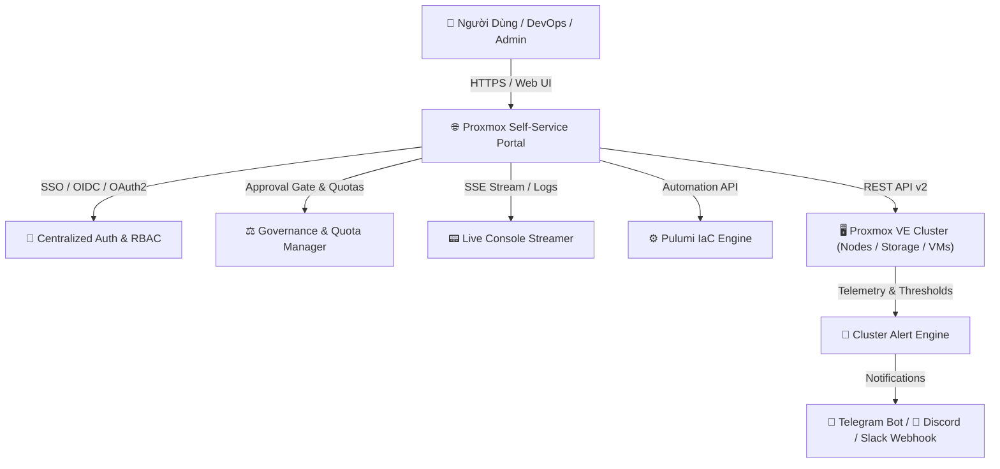

# 🚀 Proxmox VE Self-Service Portal & IaC Automation with Pulumi

English documentation: [README.en.md](./README.en.md) | **Tiếng Việt**

---

Hệ thống quản lý, giám sát và tự động hóa khởi tạo hạ tầng máy ảo (**QEMU VM**) và Container (**LXC**) trên cụm **Proxmox VE** theo mô hình **Infrastructure as Code (IaC)**. Nền tảng được xây dựng dựa trên **Pulumi Automation API**, **Node.js (TypeScript)**, giao diện Web Dashboard chuẩn **Enterprise Dark Glassmorphism** và hỗ trợ **Đa ngôn ngữ toàn diện (Song ngữ Anh - Việt)**.

---

## 🌟 Tính Năng Nổi Bật



---

### 1. 🌐 Đa Ngôn Ngữ Toàn Diện (Full Bilingual Support 🇻🇳 / 🇬🇧)
* **Chuyển ngữ tức thời (Instant Language Toggle)**: Chuyển đổi mượt mà 1-click giữa **`🇻🇳 Tiếng Việt`** và **`🇬🇧 English`** mà không cần tải lại trang.
* **Bản địa hóa 100% giao diện**: Dịch toàn bộ biểu mẫu Wizard 4 bước, thẻ tài nguyên, cảnh báo, modal cấu hình phần cứng, tường lửa, và danh mục ứng dụng.
* **Bộ dịch luồng Console thời gian thực (`formatConsoleLog`)**: Tự động chuẩn hóa và chuyển ngữ trực tiếp các sự kiện từ Server-Sent Events (SSE) theo ngôn ngữ đang chọn.

---

### 2. 🔑 Đăng Nhập Tập Trung & Phân Quyền 3 Cấp Độ (Enterprise SSO & RBAC Governance)
* **Xác thực Đa Nền tảng (Centralized SSO / OAuth2 / OIDC)**:
  * 🌐 **Google Workspace OAuth2**: Xác thực tài khoản Google công ty, kiểm soát miền email (`GOOGLE_ALLOWED_DOMAINS`) và phân quyền qua email.
  * 🐙 **GitHub OAuth**: Xác thực qua tài khoản GitHub, tự động kiểm tra quyền thành viên Organization/Team (`read:org`).
  * 🟣 **Keycloak / Authelia / Okta / Authentik (Generic OIDC)**: Tự động Discovery qua `/.well-known/openid-configuration`, phân tích claims `groups`/`roles` để tự động gán quyền RBAC.
  * 🛡️ **Local Break-glass Fallback**: Duy trì tài khoản nội bộ khẩn cấp phòng khi Identity Provider bên ngoài gặp sự cố mạng.
* **Ma trận Phân quyền 3 Vai trò (Role-Based Access Control - RBAC)**:
  * **👑 Administrator (`admin`)**: Toàn quyền quản trị hạ tầng; được phép tạo, cấu hình, thay đổi, xóa máy ảo, snapshots và firewall trên mọi môi trường (`DEV`, `STAGING`, `PROD`).
  * **👨‍💻 Developer (`developer`)**: Bị giới hạn theo chính sách Multi-tenancy — **chỉ được phép khởi tạo, quản lý nguồn và tạo snapshot máy ảo trên môi trường `DEV`**; hệ thống tự động đưa yêu cầu vào Hàng đợi Duyệt nếu triển khai trên `STAGING`/`PROD` hoặc vượt Quota.
  * **👁️ Viewer (`viewer`)**: Chế độ **Chỉ xem (Read-only)**; theo dõi tài nguyên cụm, danh sách VM, Live Console và Audit Logs nhưng bị vô hiệu hóa toàn bộ quyền tạo/xóa máy ảo, bật/tắt nguồn và thao tác cấu hình.
* **Nhật ký Kiểm toán Toàn diện (Audit Logs & Compliance)**:
  * Ghi vết đầy đủ mọi hoạt động: **Thời gian thực hiện**, **Danh tính (Username) & Vai trò (Role)**, **Hành động (Action)**, **Mục tiêu (Target VM/Stack)**, **Môi trường (Environment)**, **Trạng thái (SUCCESS / DENIED)** và **Chi tiết nguyên nhân**.

---

### 3. ⚡ Thay Đổi Cấu Hình Nóng (Hotplug Hardware) & Quản Lý Đa Ổ Đĩa (Multi-Disk)
* **Cấu hình Nóng CPU & RAM (Live Hardware Hotplug)**:
  * Điều chỉnh trực tiếp số lượng vCPU Cores và dung lượng RAM (MB/GB) trên máy ảo đang chạy mà **không cần tắt máy, không cần reboot và không làm gián đoạn stack Pulumi**.
  * Tự động kiểm tra hạn mức Quota của Developer trước khi áp dụng.
* **Mở rộng Dung lượng Đĩa Trực tuyến (Online Disk Resize)**:
  * Mở rộng dung lượng đĩa ảo trực tuyến (`+10G`, `+50G`...) ngay khi hệ điều hành đang hoạt động thông qua Proxmox QEMU Resize API.
* **Gắn thêm Đĩa phụ Đa vùng Lưu trữ (Multi-Disk Attachment)**:
  * **Khởi tạo VM với nhiều ổ đĩa**: HĐH chính nằm trên NVMe/`local-lvm`, Đĩa dữ liệu phụ nằm trên HDD/`zfs-storage`.
  * **Hot-attach đĩa phụ**: Gắn thêm đĩa mới (`scsi1`, `scsi2`...) vào VM đang chạy chỉ với 1 cú click.
  * **Tháo đĩa an toàn (Safe Detach)**: Cơ chế bảo vệ chống gỡ nhầm đĩa hệ điều hành chính (`scsi0`).

---

### 4. 🚨 Cảnh Báo Ngưỡng Tài Nguyên Toàn Cụm (Cluster Alerting & Notifications)
* **Bộ quét Giám sát Tài nguyên Tự động (Background Alert Engine)**:
  * Tự động quét toàn bộ Node và Storage Pool theo chu kỳ 30 giây.
  * Phát hiện Storage Pool vượt ngưỡng ($\ge 85\%$) hoặc Node bị quá tải CPU/RAM ($\ge 85\%$).
  * Tự động giải tỏa trạng thái cảnh báo khi chỉ số hạ xuống mức an toàn.
* **Thông báo Đa kênh Tức thời (Multi-Channel Dispatcher)**:
  * 📱 **Telegram Bot API**: Gửi thông báo HTML đẹp mắt kèm thông số chi tiết của Node/Storage.
  * 🔔 **Webhook (Discord / Slack / MS Teams / API Gateway)**: Gửi Webhook dạng Card Embed với mã màu phân cấp (Warning / Critical / Resolved).
  * 🔴 **Live In-App Alert Banner & Bell**: Thanh cảnh báo ghim đầu trang và chuông thông báo hiệu ứng nhấp nháy đỏ trên Header.
  * 🛑 **Highlight Đỏ Trực Quan**: Đổi màu đỏ cảnh báo trên thanh tiến trình Storage Pool và thẻ Node quá tải.

---

### 5. 🛡️ Tường Lửa & Quản Trị Bảo Mật Máy Ảo (Proxmox VE Firewall Management)
* **Mở/Đóng Port & Quản lý Security Rules Trực tiếp**:
  * Thêm, sửa, bật/tắt hoặc xóa Firewall Rules cho từng máy ảo (TCP/UDP/ICMP, Port Inbound/Outbound, Whitelist IP Source/Dest).
  * Điều chỉnh chính sách Firewall tổng thể (Policy `DROP` / `ACCEPT`, Enable/Disable Firewall).
* **Presets Quy tắc An ninh 1-Click**:
  * 🌐 **Web Server**: Mở nhanh Port 80 (HTTP), 443 (HTTPS).
  * 🔑 **SSH Remote**: Mở Port 22 (SSH) có giới hạn IP hoặc công khai.
  * 🐘 **Database**: Mở Port 5432 (PostgreSQL), 3306 (MySQL), 6379 (Redis).
  * ⛵ **Kubernetes**: Mở Port 6443 (K8s API Server).

---

### 6. ⚖️ Quản Trị Hạn Mức Tài Nguyên & Cổng Phê Duyệt (Resource Quotas & Approval Gateway)
* **Hạn mức Quota Theo Vai trò (Developer Resource Quotas)**:
  * Đặt hạn mức cứng cho Developer: **Tối đa 2 VMs hoạt động đồng thời**, **Tối đa 4 vCPUs**, **Tối đa 8GB RAM (8192 MB)**.
  * Tab **Phê Duyệt & Quota** hiển thị thanh tiến trình trực quan (% RAM, % vCPU, % VMs) theo thời gian thực.
* **Cổng Phê duyệt Tự động (Approval Workflow Gate)**:
  * Khi Developer yêu cầu tạo VM trên môi trường **`STAGING` / `PROD`** hoặc yêu cầu tài nguyên **vượt định mức Quota**, hệ thống tự động chuyển yêu cầu vào Hàng Đợi Chờ Duyệt (Approval Queue).
  * **Admin 1-Click Approval**: Quản trị viên có thể **Phê duyệt (Approve)** hoặc **Từ chối (Reject)** trực tiếp trên Web UI. Pulumi Engine sẽ tự động kích hoạt ngầm ngay sau khi duyệt.

---

### 7. 📦 Hỗ Trợ LXC Container & Thư Viện App Catalog Dựng Sẵn
* **Chuyển đổi Linh hoạt QEMU VMs & LXC Containers**:
  * Hỗ trợ tạo cả máy ảo đầy đủ (QEMU) và Container siêu nhẹ (LXC khởi động trong 1 giây).
* **Thư viện Ứng dụng Dựng sẵn 1-Click (1-Click App Catalog)**:
  * 🐘 **PostgreSQL 16 Enterprise**: Tự động cài đặt PostgreSQL 16, tạo Database `appdb`, tạo User `appuser` và mở remote access.
  * ⚡ **Redis 7 In-Memory**: Cài đặt Redis Server, đặt mật khẩu bảo vệ, giới hạn Maxmemory LRU và mở port 6379.
  * 🪣 **MinIO Enterprise S3 Storage**: Khởi tạo MinIO Object Storage, phân vùng data và cấu hình Web Console (port 9001) / S3 API (port 9000).
  * ⛵ **Kubernetes (k3s Node)**: Tự động bootstrap k3s Kubernetes node với kubeconfig phân quyền chuẩn.
  * 🐳 **Docker & Docker Compose**: Cài đặt môi trường containerization hoàn chỉnh.
  * 🌐 **NGINX Web Server**: Thiết lập Reverse Proxy & Static Web Server sẵn sàng phục vụ.

---

### 8. 🧙‍♂️ Trình Tạo Máy Ảo 4 Bước (Multi-Step Creation Wizard) & Chọn Nhanh Hệ Điều Hành
* **Bộ chọn Nhanh Hệ Điều Hành Trực quan (Visual OS Distro Presets)**:
  * 🐧 **Ubuntu Linux**: Ubuntu Server LTS (24.04 / 22.04 LTS) Cloud-Init / ISO.
  * 🐧 **Debian GNU/Linux**: Debian 12 Bookworm / 11 Bullseye Cloud-Init / Stable.
  * 🐧 **Rocky / Enterprise Linux**: Rocky Linux 9 / AlmaLinux 9 / CentOS RHEL-compatible.
  * 🐧 **Alpine Linux**: Ultra-Lightweight / Micro Cloud-Init.
  * 🪟 **Windows Server / Desktop**: Windows Server 2022 / 2019 / Windows 11 ISO.
  * 📁 **Custom Storage Files**: Chế độ chọn file ISO/Img thô trực tiếp từ Storage kèm ô lọc tìm kiếm thời gian thực.
* **Cơ chế Tự Động Quét & Dò Tìm File Chuẩn (Smart Image Auto-Detection)**:
  * Tự động quét toàn bộ Proxmox Storage trên Node được chọn để tìm file khớp theo từ khóa (`ubuntu*`, `debian*`, `rocky*`, `win*`...).
  * Tự động điền đường dẫn tối ưu và hiển thị dropdown chọn phiên bản nếu có nhiều bản (ví dụ có cả 22.04 và 24.04).
* **Chuẩn đặt tên file Image trên Proxmox VE (`local:iso/...`)**:
  | Hệ Điều Hành | Tên file khuyến nghị trên Proxmox | Loại Image |
  | :--- | :--- | :--- |
  | **Ubuntu Linux** | `ubuntu-24.04-cloud.img` hoặc `ubuntu-22.04-cloud.img` | Cloud-Init (.img / .qcow2) |
  | **Debian Linux** | `debian-12-cloud.img` hoặc `debian-11-cloud.img` | Cloud-Init (.img / .qcow2) |
  | **Rocky / Alma Linux** | `rocky-9-cloud.img` hoặc `almalinux-9-cloud.img` | Cloud-Init (.img / .qcow2) |
  | **Alpine Linux** | `alpine-3.20-cloud.img` | Cloud-Init (.img / .qcow2) |
  | **Windows Server** | `Windows_Server_2022.iso` | Installer ISO (.iso) |

* **Bộ lọc Tag Chuẩn Hóa (Proxmox VE Tag Sanitizer)**: Tự động chuẩn hóa định dạng tag (`^[a-z0-9_][a-z0-9_\-\.]*$`), loại bỏ hoàn toàn lỗi HTTP 400 Parameter Verification khi khởi tạo VM.
* **Quy trình Khởi tạo Trực quan**:
  * **Bước 1**: Đặt tên VM, chọn môi trường (`DEV`, `STAGING`, `PROD`), cấu hình số lượng (Batch 1-10 VMs) và chọn Node đích/Round-Robin.
  * **Bước 2**: Chọn Proxmox Node, OS Image/Template và Storage Pool chính (kèm hiển thị dung lượng Trống / Free theo thời gian thực).
  * **Bước 3**: Tùy chỉnh Hardware (vCPU, RAM, OS Disk), gắn thêm **Đĩa Phụ (Secondary Disks)** trên các pool khác nhau, cấu hình Network Bridge & VLAN Tag.
  * **Bước 4**: Nhúng Cloud-Init User-Data script, Preset mẫu và SSH Public Key.

---

### 9. 📊 Giám Sát Tài Nguyên Toàn Cụm & Điều Hướng Thông Minh
* **Thanh Điều hướng Node Ghim Cố định (Sticky Node Nav)**: Tự động cuộn mượt (Smooth scroll) tới Node và tạo hiệu ứng phát sáng viền.
* **Tìm kiếm Tức thì (Instant Search)**: Lọc thời gian thực theo Tên VM, ID, IP, Node, Môi trường và Tags.
* **Quản lý Vòng đời Máy ảo (VM Lifecycle)**:
  * Bật (Start), Tắt an toàn (ACPI Shutdown), Tắt nóng (Force Stop), Khởi động lại (Reboot).
  * **Web Console Trực tiếp**: Mở noVNC Console ngay trong Web Portal.
  * **Snapshot Manager**: Tạo snapshot (kèm RAM state), khôi phục (Rollback) và xóa snapshot.

---

## 📁 Cấu Trúc Thư Mục Dự Án

```text
pulumi-proxmox/
├── public/                       # Giao diện Web Portal (Dark Glassmorphism UI)
│   ├── index.html                # Cấu trúc HTML, Modals, Wizard, Sub-tabs & i18n hooks
│   ├── style.css                 # Hệ thống CSS Design System & Responsive Layout
│   ├── i18n.js                   # Từ điển đa ngôn ngữ (vi / en) & Dynamic Localizer
│   └── js/                       # Module Frontend theo tính năng (Modular JavaScript)
│       ├── main.js               # Entry point, tab routing, dark theme & boot initialization
│       ├── auth.js               # Xác thực người dùng, SSO callback, RBAC, đổi mật khẩu
│       ├── wizard.js             # Form tạo VM 4 bước, OS presets, app catalog, validation
│       ├── vms.js                # Bảng Stacks Pulumi, lọc tìm kiếm, xóa VM an toàn
│       ├── hardware.js           # Live hardware hotplug (CPU/RAM), online disk resize & attach
│       ├── firewall.js           # Proxmox VE Firewall rules & security presets
│       ├── snapshots.js          # Quản trị Snapshot (tạo kèm RAM, khôi phục, xóa)
│       ├── alerts.js             # Cảnh báo ngưỡng tài nguyên, cấu hình Telegram/Webhook
│       ├── approvals.js          # Cổng phê duyệt & Quota manager dành cho Developer
│       ├── audit.js              # Nhật ký kiểm toán (Audit Logs) & Compliance tracking
│       ├── console.js            # Live Web noVNC Console modal
│       ├── cluster.js            # Tổng quan cụm Node/Storage, đồ thị và telemetry
│       ├── state.js              # Quản lý State tập trung toàn ứng dụng
│       └── utils.js              # Định dạng bytes, escape HTML, copy to clipboard
├── src/                          # Mã nguồn Backend & Pulumi IaC
│   ├── server.ts                 # Express Server, REST APIs, RBAC Guard & Pulumi Runner
│   ├── auth-service.ts           # Centralized SSO Service (Google, GitHub, Keycloak OIDC, Local)
│   ├── alert-service.ts          # Cluster Resource Alert Engine (Telegram, Webhook, Thresholds)
│   ├── proxmox-api.ts            # Proxmox VE REST Client (QEMU, LXC, Hotplug, Resize, Disks, Firewall)
│   ├── pulumi-program.ts         # Khai báo tài nguyên Pulumi IaC, Tag Sanitizer & Cloud-Init
│   └── types/                    # TypeScript interfaces & type definitions
├── .env.example                  # Mẫu cấu hình biến môi trường chi tiết
├── package.json                  # Dependencies & NPM Scripts
├── Pulumi.yaml                   # Khai báo dự án Pulumi
├── tsconfig.json                 # Cấu hình TypeScript
├── README.md                     # Tài liệu tiếng Việt
└── README.en.md                  # English Documentation
```

---

## ⚙️ Yêu Cầu Hệ Thống

1. **Node.js**: Phiên bản 18 trở lên (Khuyên dùng **Node.js 20+ LTS**).
2. **Pulumi CLI**: Đã cài đặt trên máy chủ/máy trạm (`pulumi version` $\ge 3.100.0$).
3. **Proxmox VE**: Cụm Proxmox VE 7.x hoặc 8.x có bật API Token và quyền quản trị.
4. **QEMU Guest Agent & Cloud-Init**: Cài đặt sẵn trong các Cloud Images/Templates để nhận diện IP và hỗ trợ hotplug.

---

## 🚀 Hướng Dẫn Cài Đặt & Triển Khai

### Bước 1: Cài đặt Dependencies

```bash
npm install
# Hoặc nếu dùng pnpm:
pnpm install
```

### Bước 2: Cấu hình Biến Môi Trường (`.env`)

Tạo file `.env` từ file mẫu `.env.example`:

```bash
cp .env.example .env
```

Chỉnh sửa file `.env` với thông số cụm Proxmox và cấu hình SSO (nếu dùng):

```env
# ==========================================
# PROXMOX VE CLUSTER CONFIGURATION
# ==========================================
PROXMOX_VE_ENDPOINT="https://192.168.1.60:8006"
PROXMOX_VE_INSECURE="true"
PROXMOX_VE_API_TOKEN="root@pam!pulumi=xxxxxxxx-xxxx-xxxx-xxxx-xxxxxxxxxxxx"
PROXMOX_VE_SSH_USERNAME="root"
PROXMOX_VE_SSH_PASSWORD="your-proxmox-ssh-password"

# ==========================================
# SERVER & SECURITY
# ==========================================
PORT=3000
PORTAL_BASE_URL="http://localhost:3000"
SESSION_SECRET="your-super-secure-session-secret"

# ==========================================
# LOCAL BREAK-GLASS ACCOUNTS
# ==========================================
AUTH_LOCAL_ENABLED="true"
AUTH_ADMIN_USERNAME="admin"
AUTH_ADMIN_PASSWORD="Admin@123"
AUTH_DEV_USERNAME="developer"
AUTH_DEV_PASSWORD="dev123"
AUTH_VIEWER_USERNAME="viewer"
AUTH_VIEWER_PASSWORD="view123"

# ==========================================
# (OPTIONAL) SINGLE SIGN-ON (SSO)
# ==========================================
# 1. OpenID Connect (Keycloak / Authelia / Okta / Authentik)
OIDC_ENABLED="false"
OIDC_NAME="Keycloak SSO"
OIDC_ISSUER_URL="https://auth.yourdomain.com/realms/master"
OIDC_CLIENT_ID="proxmox-portal"
OIDC_CLIENT_SECRET="your_oidc_client_secret"
OIDC_SCOPES="openid profile email"
OIDC_GROUP_CLAIM="groups"
OIDC_ADMIN_GROUPS="proxmox-admins,devops-leads"
OIDC_DEV_GROUPS="developers,devsecops"

# 2. Google Workspace OAuth2
GOOGLE_OAUTH_ENABLED="false"
GOOGLE_CLIENT_ID="your_client_id.apps.googleusercontent.com"
GOOGLE_CLIENT_SECRET="your_google_client_secret"
GOOGLE_ALLOWED_DOMAINS="yourcompany.com"
GOOGLE_ADMIN_EMAILS="admin@yourcompany.com"
GOOGLE_DEV_EMAILS="dev@yourcompany.com"

# 3. GitHub OAuth
GITHUB_OAUTH_ENABLED="false"
GITHUB_CLIENT_ID="your_github_client_id"
GITHUB_CLIENT_SECRET="your_github_client_secret"
GITHUB_ALLOWED_ORGS="your-org"
GITHUB_ADMIN_TEAMS="devops"
GITHUB_DEV_TEAMS="developers"

# ==========================================
# (OPTIONAL) ALERT NOTIFICATIONS
# ==========================================
ALERT_TELEGRAM_ENABLED="false"
ALERT_TELEGRAM_BOT_TOKEN=""
ALERT_TELEGRAM_CHAT_ID=""
ALERT_WEBHOOK_ENABLED="false"
ALERT_WEBHOOK_URL=""
```

### Bước 3: Khởi chạy Ứng dụng

* **Chế độ Phát triển (Dev Mode với Hot Reload)**:
  ```bash
  npm run dev
  ```
* **Chế độ Production**:
  ```bash
  npm start
  ```

Truy cập giao diện Web Dashboard tại: `http://localhost:3000`

---

## 🔒 Hướng Dẫn Tạo Proxmox API Token

1. Truy cập Web UI Proxmox VE ➔ **Datacenter** ➔ **Permissions** ➔ **API Tokens**.
2. Nhấn **Add**:
   - **User**: `root@pam` (hoặc user quản trị chuyên dụng).
   - **Token ID**: `pulumi`.
   - Bỏ chọn ô *Privilege Separation* nếu muốn token kế thừa toàn quyền của User.
3. Sao chép chuỗi **Secret Token** và điền vào biến `PROXMOX_VE_API_TOKEN` trong `.env`.
